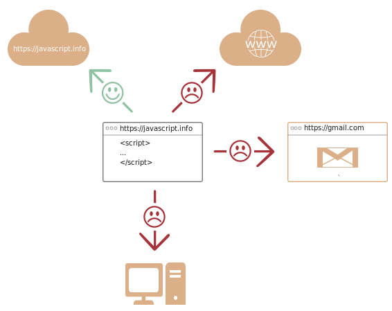

# Bevezetés a JavaScriptbe

Miért különleges a JavaScript? Mi mindent tudunk megvalósítani vele? Milyen technológiai megoldások lehetségesek a használatával? Ezeket a kérdéseket válaszoljuk meg a következőkben.

## Mi az a JavaScript?

A *JavaScriptet* eredetileg azért alkották meg, hogy "életre keltse" a weboldalakat.

A JavaScript nyelven írt programokat *szkripteknek* (*script*) nevezzük. Közvetlenül a weboldalak HTML kódjába írhatóak, ahol automatikusan lefutnak az oldal betöltése során.

A szkripteket egyszerű szövegként írjuk, semmiféle különleges előkészítést, *fordítást* (*compiling*) nem igényelnek.

A JavaScript e tekintetben lényegesen különbözik a [Java](https://hu.wikipedia.org/wiki/Java_(programozási_nyelv)) programozási nyelvtől.

```smart header="Miért nevezik <u>Java</u>Scriptnek?"
A születésekor még a LiveScript nevet viselte, de mivel akkoriban a Java igen népszerű volt, úgy döntöttek, hogy megpróbálják annak "kistestvéreként" pozicionálni.

Később, ahogy a nyelv fejlődött, teljesen függetlenné vált, önálló specifikációval, amit [ECMAScriptnek](https://hu.wikipedia.org/wiki/ECMAScript) neveznek. A JavaScriptnek tehát semmi köze a Java nyelvhez.
```

Mára már nem csak a böngészőben futtathatunk JavaScriptet, hanem a szervereken is, sőt, tulajdonképpen bármilyen eszközön, amely képes egy úgynevezett [JavaScript-motor](https://hu.wikipedia.org/wiki/JavaScript-motor) futtatására.

A böngészőkbe épített JavaScript-motort *JavaScript virtuális gépnek* is szokás hívni.

A különböző böngészőkbe épített motoroknak mind saját kódneve van, például:

- [V8](https://hu.wikipedia.org/wiki/V8_JavaScript-motor) -- Chrome és Opera.
- [SpiderMonkey](https://en.wikipedia.org/wiki/SpiderMonkey) -- Firefox.
- ...és még egy sor másik, úgymint "Trident" és "Chakra" a különböző Internet Explorer verziókban, "ChakraCore" a Microsoft Edgeben, vagy a "Nitro" és "SquirrelFish" a Safariban.

Jó, ha ismerjük a fenti fogalmakat, ugyanis vissza fognak köszönni a fejlesztőknek szánt cikkekben, például amikor arról van szó, hogy egy funkció támogatott-e a V8 által.

```smart header="Hogy működnek a JavaScript-motorok?"

Habár a JavaScript-motorok összetettek, az alapvető működésük igen egyszerű.

1. A motor beolvassa és kielemzi a szkriptet (*parsing*, *elemzés*).
2. Átalakítja a kódot gépi kódra (*compiling*, *fordítás*).
3. A gépi kód lefut.

A motor különféle optimalizációkat hajt végre a lépések során, sőt, a lefordított kódot is monitorozza futás közben, hogy dinamikusan tovább optimalizálja a gépi kódot.
```

## Mire képes a böngészőben futó JavaScript?

A JavaScript egy "biztonságos" nyelv, nem ad hozzáférést olyan alacsonyszintű erőforrásokhoz, mint a processzor vagy a memória, mivel eredetileg kizárólag a böngészőkben való futásra szánták, s ott ezekre nincs szükség.

Egy JavaScript program lehetőségeit nagyban befolyásolja a környezet, amelyben fut. [Node.js](https://hu.wikipedia.org/wiki/Node.js) esetén például tetszőlegesen írhatunk/olvashatunk fájlokat, kezdeményezhetünk hálózati hívásokat.

Ezzel szemben egy böngészőben futó JavaScript programmal manipulálhatjuk a weboldalt, reagálhatunk a felhasználó ténykedéseire, kommunikálhatunk a weboldalt kiszolgáló webszerverrel. 

Néhány konkrét példa:

- HTML elemek létrehozása, tartalom és formázás módosítása.
- Kattintásra, egér mozgatásra, billentyű leütésre történő reagálás.
- Kommunikáció távoli szerverekkel, fájlok letöltése és feltöltése ([AJAX](https://hu.wikipedia.org/wiki/Ajax_(programozás)) és [COMET](https://hu.wikipedia.org/wiki/Comet).
- Sütik beállítása és lekérése, üzenetek és kérdések megjelenítése.
- Adatok tárolása kliens oldalon ("local storage", azaz helyi tárban).

## Mire NEM képes a böngészőben futó JavaScript?

A böngészőben futó JavaScript, a felhasználó érdekében, több szempontból is korlátozva van. A cél az adatainkhoz való illetéktelen hozzáférés megakadályozása.

Például:

- A weboldalakon futó JavaScript programok nem férnek hozzá az operációs rendszer szolgáltatásaihoz, nem tudnak tetszőlegesen fájlokat írni/olvasni.

    A modern böngészők korlátozottan és csakis a felhasználó közreműködésével képesek bizonyos fájlműveletekre, például fájlfeltöltésre egy `<input>` HTML elemen keresztül.

    A webkamera és a mikrofon, a felhasználó kifejezett engedélyével, elérhetőek, de engedély nélkül, alattomosan, nem férhet hozzájuk egyetlen weboldal sem, így nem kell aggódnunk, hogy adataink ezeken keresztül eljutnának az [NSA](https://hu.wikipedia.org/wiki/National_Security_Agency)-hez.
- A böngészőfülek és ablakok alapesetben nem tudnak kommunikálni egymással. Erre csak abban az esetben van lehetőség, ha egy weboldalon futó JavaScript nyit meg egy új fület vagy ablakot, de még ebben az esetben is csak azzal a feltétellel, hogy a megnyitott oldal ugyanarról a webcímről származik (azaz a protokoll, a kiszolgáló és a port is megegyezik).

    Ez a korlátozás a Same Origin Policy (SOP), vagyis az "azonos eredet szabálya". A szabály feloldásához *mindkét* weboldalnak engedélyeznie kell az adatátvitelt, illetve maga a kommunikáció is speciális JavaScript kódot igényel -- erre a későbbiek során fogunk példát látni.

    Ez a szabály szintén a felhasználót védi, ugyanis így az egyik fülön megnyitott `http://tetszoleges-weboldal.com` nem fér hozzá az egy másik fülön megnyitott `http://gmail.com` oldalon a levelekhez.
- A weboldalakon futó JavaScript minden további nélkül képes kommunikálni azzal a kiszolgálóval, amelyikről betöltődött, de a más kiszolgálókkal történő kommunikáció különleges eljárásokat igényel a kiszolgáló oldalán. Ez ismét egy fontos biztonsági korlátozás.



Ezek a korlátozások nem léteznek a böngészőn kívül, így például a szervereken. Ezeken túlmenően, a modern böngészőkbe különféle bővítményeket telepíthetünk, amelyek további engedélyeket igényelhetnek. 

## Mi teszi a JavaScriptet különlegessé?

*Három* érv a JavaScript mellett:

```compare
+ Teljeskörű HTML/CSS integráció.
+ Az egyszerű dolgok kivitelezése egyszerű.
+ Minden modern böngésző támogatja és alapértelmezetten engedélyezi a futtatását.
```
A JavaScript az egyetlen böngésző-technológia, amely mindhárom előnnyel rendelkezik.

Ezért olyan különleges a JavaScript és ezért terjedhetett el és válhatott a felhasználói felületek kivitelezésének elsőszámú eszközévé.

Ezzel együtt a JavaScript kiválóan alkalmas szerverek programozására, mobilalkalmazások fejlesztésére és még sok minden másra is.

## JavaScriptre épülő nyelvek

A JavaScript szintaxisa nem felel meg és nem is felelhet meg mindenki elvárásainak, ugyanis az egyes fejlesztőknek eltérőek az igényeik.

Ez természetes, hiszen a projektek és a követelmények is eltérőek.

A JavaScript megjelenése óta egy sor nyelv bukkant fel, amelyeket JavaScriptté kell alakítani (*transpiling*), mielőtt le tudnánk futtatni a programot böngészőben.

A modern fejlesztői eszközök rendkívül gyorsak és transzparensek, így lényegében a JavaScripttől teljesen eltérő nyelven is kódolhatunk, miközben az automatikusan JavaScriptté alakul a háttérben.

Néhány példa:

- [CoffeeScript](http://coffeescript.org/): úgynevezett *szintaktikai cukorkákat* (*syntactic sugar*) alkalmazó nyelv. Tömörebb szintaxissal rendelkezik, így világosabb és rövidebb kódot írhatunk. A Ruby fejlesztők jellemzően kedvelik.
- [TypeScript](http://www.typescriptlang.org/): elsősorban szigorú típusossággal egészíti ki a JavaScriptet, elősegítve a nagy bonyolultságú rendszerek fejlesztését és karbantartását. A Microsoft fejlesztése.
- [Flow](http://flow.org/): szintén a szigorúbb típusosságot valósítja meg, de a TypeScripttől eltérő módon. A Facebook fejlesztése.
- [Dart](https://www.dartlang.org/): önálló nyelv, saját, böngészőn kívüli motorral. JavaScriptté alakítható. A Google fejlesztése.
- [Brython](https://brython.info/) is a Python transpiler to JavaScript that enables the writing of applications in pure Python without JavaScript.
<<<<<<< HEAD
- [Kotlin](https://kotlinlang.org/docs/js-overview.html): egy modern, tömör, biztonságos programozási nyelv, amellyel böngésző és Node alá is fejleszthetünk .
=======
- [Kotlin](https://kotlinlang.org/docs/reference/js-overview.html) is a modern, concise and safe programming language that can target the browser or Node.
>>>>>>> 468e3552884851fcef331fbdfd58096652964b5f

A fentieken túl számos más JavaScripten alapuló nyelv létezik. Még akkor is, ha egy JavaScriptté alakítandó nyelvvel dolgozunk, mindenképpen érdemes alaposan ismerni a JavaScriptet, hogy valóban értsük, hogyan működik a programunk.

## Összefoglalás

- A JavaScriptet eredetileg kizárólag böngészőben való futtatásra szánták, mára azonban számtalan egyéb környezetben alkalmazzák.
- A JavaScript egyedülálló helyzetben van a legszélesebb körben elterjedt böngészőoldali programozási nyelvként, teljeskörű HTML és CSS integrációval.
- Számos JavaScriptre forduló nyelv létezik. Érdemes megismerkedni velük, miután magabiztos JavaScript tudásra tettünk szert.
